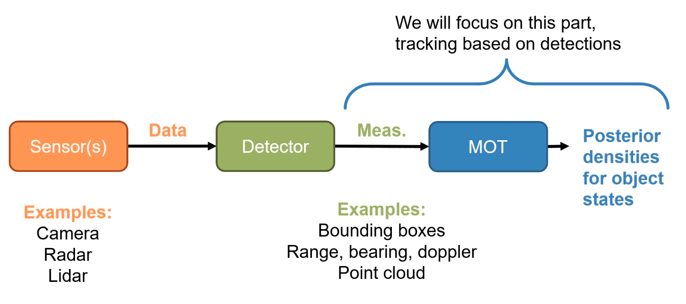
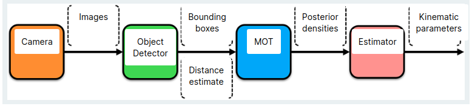
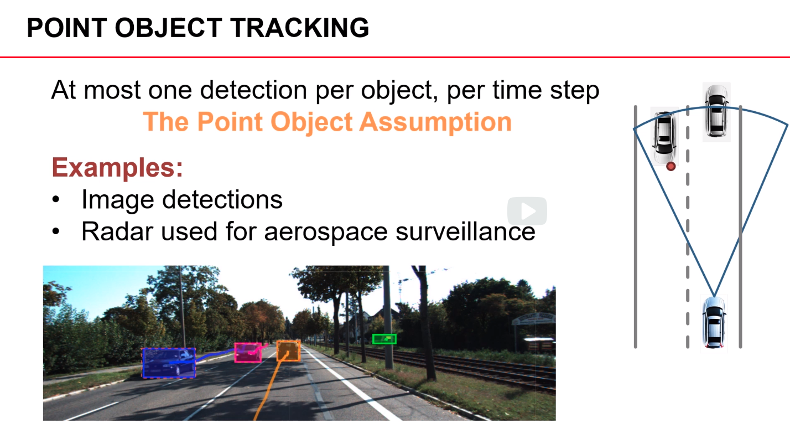
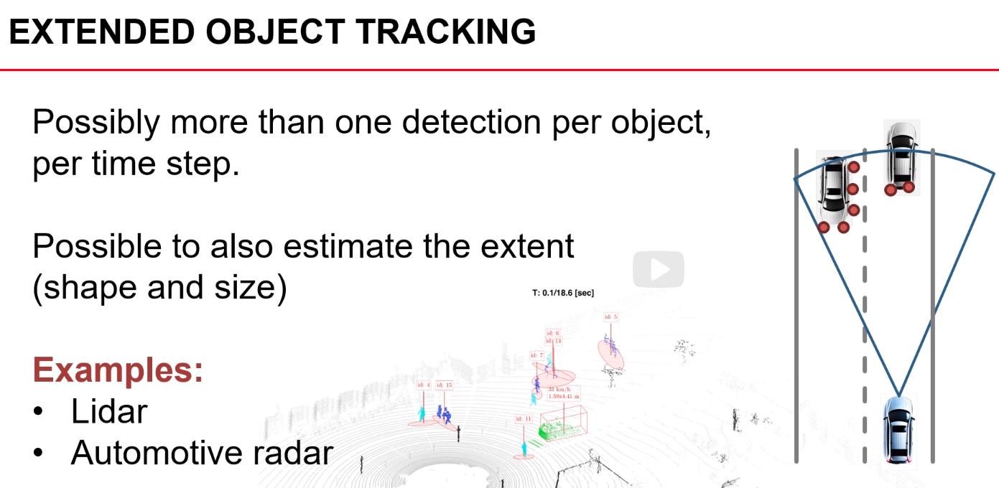
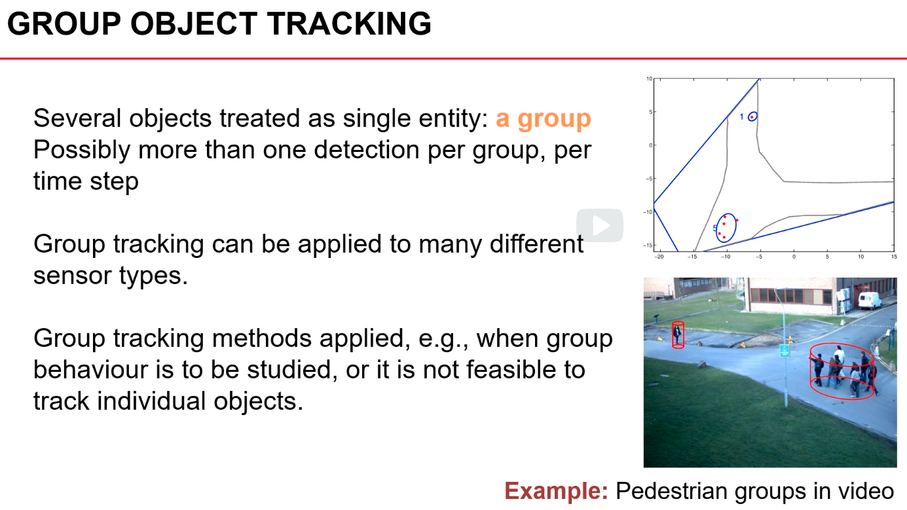
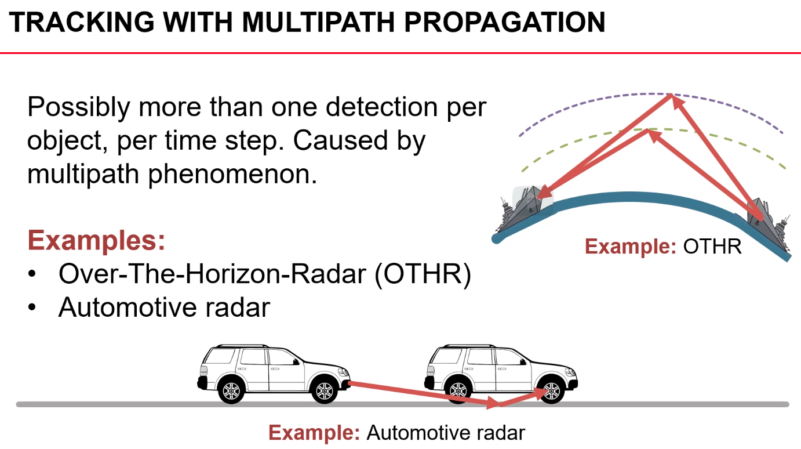
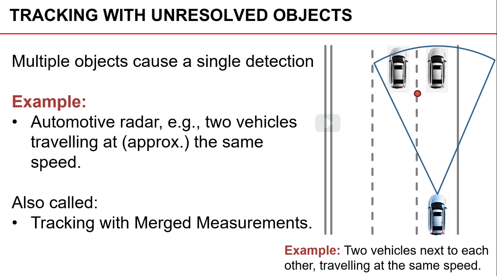
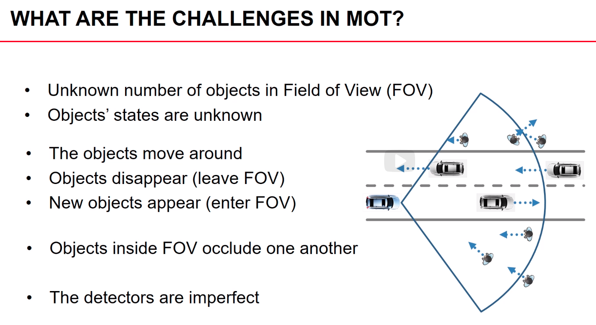

# Introduction

---

## Overview

### Workflow

### Case Analysis:

---

## Different Types of Tracking

### Point Object Tracking

### Extended Object Tracking

### Group Object Tracking

### Tracking with Multi-Path Propagation

### Tracking with Unresolved Objects

---

## Challenges

