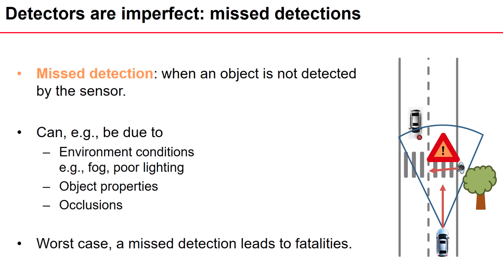
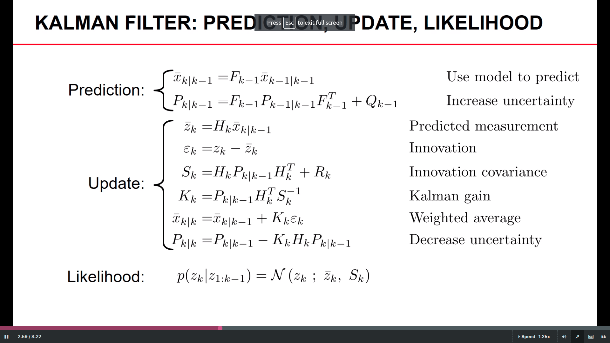

# Prelogue

---

## Introduction

### Problem Definition

`Multi-Object Tracking` is the sequential processing of noisy sensor measurements to determine:

* the number of dynamic objects

* each dynamic object's state

At each timestamp, the number of measurements per object depends on the sensor, the detector and the object characteristics.

### Overview

#### Workflow

#### Case Analysis:

### Different Types of Tracking

#### Point Object Tracking

#### Extended Object Tracking

#### Group Object Tracking

#### Tracking with Multi-Path Propagation

#### Tracking with Unresolved Objects

### Challenges

The challenges in `Multi-Object Tracking` can be summarized as follows:

* restricted field-of-view(FOV).

* stochastic object birth-death in FOV.

* sensor occlusion.

* detector error.

* data association error.

---

## Bayesian Filtering

### Overview

Process `the sequential measurements` and estimate `the posterior density of the state of interest`.

### Motion Models

Example: Vehicle Agent Motion Model

### Measurement Models

Example: Radar & Lidar Measurement Model

### Sequential Processing Workflow

Multi-Object Tracking Sequential Processing Workflow

* Chapman-Kolmogorov Prediction

* Predicted Measurement Likelihood for Association

* Bayesian Measurement Update

### Output

### Evaluation

---

## Kalman Filtering

### Introduction

`Kalman Filter` is the minimum mean squared error (MMSE) when:

* `motion` & `measurement` models are both linear

* noises are `Gaussian`

* initial state is `Gaussian`

### Processing Workflow

### Non-Linear Models

### Uncertainty Propagation

---

## Assumed Density Tracking

`Assumed Density Tracking` is the foundation of practical MOT system:

* it helps to transform `the Chapman-Kolmogorov prediction` and `the Bayesian update` into closed-form parameter update.

* it ensures the predictable complexity of the actual MOT system.

